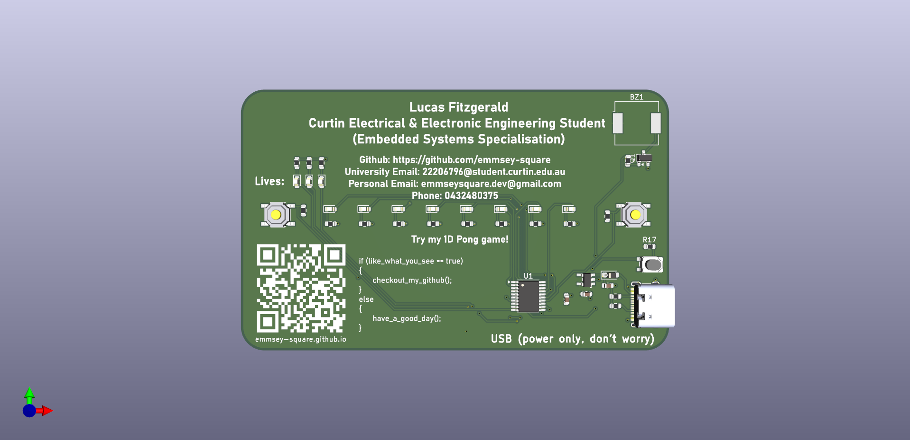
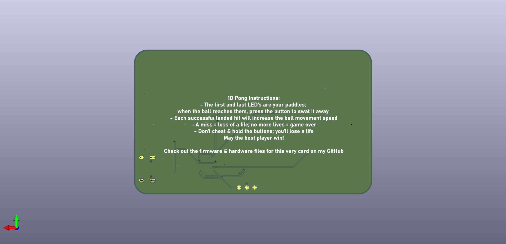

#   PCB Business Card- A Business Card to Help Me Stand Out

## Brief 
I've seen online heaps of people in the hobbyist/engineering field design their own business cards/badges to  give out to people, and I wnated to make one of my own to help me stand out among my peers.

My spin on the PCB business card is a simple 1D Pong game; there's a string of LED's between two pushbutton switches, with one LED lighting up at a time and moving along the string in alternating directions. When the LED reaches the end of the string, the player must press the button on that side to 'swat' it away, otherwise they will lose 1 of their 3 lives. Each successful swat increases the speed of the LED movement, until eventually it's impossible to win. Additionally, holding the buttons the whole time (AKA cheating) results in a loss of a life. Losing all lives results in game over. 
## Design Choices 
- Utilising a CH32V003 for my main mcu, as it is a cheap 32-bit RISCV chip with plenty of peripherals and IO for a business card. I have an interest in the RISCV ISA, and there's a huge open source community around this chip mainly thanks to cnlohr and his [ch32fun SDK](https://github.com/cnlohr/ch32fun) 
- USB-C port port mainstream compatibility, although people will be understandably hesitant to plug this into things
- Onboard passive buzzer for sound effects (work in progress)
